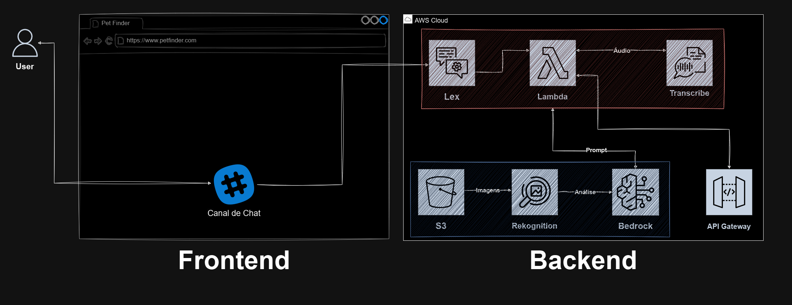

# "Pet Finder" - Plataforma de Busca por Pets Desaparecidos e Incentivo à Adoção

## Descrição

Este projeto tem como objetivo auxiliar no resgate de pets desaparecidos e promover a adoção responsável de cães, utilizando tecnologias de reconhecimento de imagem e IA da AWS. A plataforma permite que usuários enviem fotos de seus pets desaparecidos para encontrar seus cães semelhantes em um banco de dados, e oferece sugestões personalizadas de adoção de acordo com o perfil da família.

## Funcionalidades Principais

- **Busca por Pets Desaparecidos**: Utiliza o **Amazon Rekognition** para comparar fotos enviadas com imagens de pets no banco de dados.
- **Recomendações Personalizadas de Adoção**: Com base no perfil da família, o sistema sugere cães disponíveis para adoção.
- **Dicas de Adoção e Cuidados**: Informações personalizadas sobre o cuidado e adaptação dos pets.
- **Chatbot para Assistência**: O **Amazon Lex** oferece um canal de comunicação para ajudar na busca por pets e orientar na adoção.

## Arquitetura Utilizada

A arquitetura AWS proposta para este projeto inclui as seguintes ferramentas e serviços:

- **Amazon Rekognition**: Para reconhecimento de imagem e busca por pets desaparecidos.
- **Amazon Lex**: Chatbot que auxilia na navegação e na adoção de pets.
- **Amazon Transcribe**: Permite que os usuários enviem comandos por voz.
- **Amazon Bedrock**: Utilizado para personalizar as recomendações de adoção.
- **Amazon S3**: Armazenamento de fotos de pets e dados de adoção.

## Estrutura do Projeto

O projeto será dividido nas seguintes áreas principais:

- `frontend/`: Interface web que permite o envio de fotos e interações com o chatbot.
- `backend/`: Lógica de busca, adoção e integração com os serviços AWS.
- `services/`: Configurações e integrações com o **Rekognition**, **Lex**, entre outros.
- `scripts/`: Scripts automatizados para configurar e gerenciar a infraestrutura AWS.

## Integração com Chatbot:
- Configurar o Amazon Lex para fornecer dicas sobre adoção e auxiliar os usuários na busca de pets desaparecidos.
- Testar a funcionalidade de reconhecimento de comandos por voz com o Amazon Transcribe.

## Configuração de Recomendações Personalizadas:
- Desenvolver o sistema de recomendações de adoção com base no perfil do usuário, utilizando o Amazon Bedrock.

## Configuração da Infraestrutura AWS:
- Configurar os serviços AWS mencionados, garantindo a integração entre eles e o banco de dados de pets.

## Desenvolvedores
 | [ Moniza Oliveira](https://github.com/MONIZA-OLIVEIRA) |  [ Hugo Susini](https://github.com/hsusini) |  [ Jean Carlos](https://github.com/JeanPTBR) |  [ John Sousa](https://github.com/johnSousa23) | [ Victor Sousa](https://github.com/souiuri)
| :---: | :---: | :---: | :---: | :---: |
